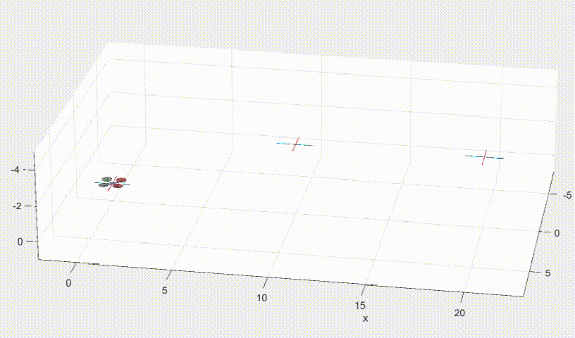
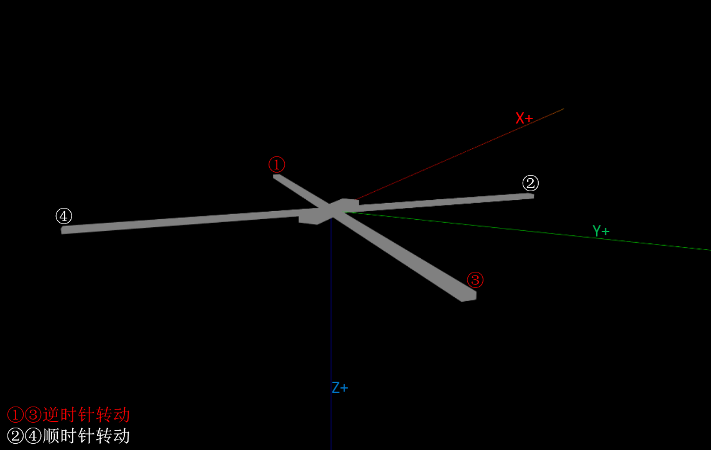

## 简介

爱好四轴飞行器，不满足于组装电子元件能够飞起来，更想了解其背后的数学模型。所以先编写一个仿真程序，可能是最完整和最经济的学习手段。
1. 首先，**根据牛顿-欧拉方程建立四旋翼飞行器的动力学和运动学模型**，从而可以根据飞行器的实时状态（受力、位姿、线速度和角速度等数据），计算输出其实时位姿变化（线加速度和角加速度），并可视化仿真程序。
2. 其次，进行线性模型化简，**根据 PID 控制律设计底层飞行控制器**，以飞行器的实时状态和飞行指令（定点等）为输入，实时计算对应的螺旋桨转速数据，并在仿真程序中进行测试和验证。

## 坐标系

对于四旋翼模型来说，需要两个坐标系。初始状态下，这个两个坐标系完全重合，且和 Three.js 和 Blender 的坐标系定义一致。
* 全局坐标系/大地坐标系/惯性坐标系，XYZ 的正方向分别对应北东地方向 (NED)
* 机体坐标系，XYZ 的正方向分别对应前右下方向

螺旋桨位置：
* $ \omega_1 = (1, -1, 0) $ 机体的左前方
* $ \omega_2 = (1, 1, 0) $ 机体的右前方
* $ \omega_3 = (-1, 1, 0) $ 机体的右后方
* $ \omega_4 = (-1, -1, 0) $ 机体的左后方

$ \phi \ \theta \ \psi $ 分别表示绕 $ X $ 轴旋转的**翻滚角 Roll**、绕 $ Y $ 轴旋转的**俯仰角 Pitch** 以及绕 $ Z $ 轴旋转的**偏航角 Yaw**，即欧拉角。旋转方向由右手螺旋定义。

任一机体坐标系下的向量 $p^b$ 左乘旋转矩阵 $ R_b^e $ 即可得到地球坐标系下对应的向量 $$ p^e $$

$$
p^e = R_b^e p^b= 
\begin{bmatrix} 
cos(\theta)cos(\psi) & cos(\psi)sin(\theta)sin(\phi)-sin(\psi)cos(\phi) & cos(\psi)sin(\theta)cos(\phi)+sin(\psi)sin(\phi) \\ 
cos(\theta)sin(\psi) & sin(\psi)sin(\theta)sin(\phi)+cos(\psi)cos(\phi) & sin(\psi)sin(\theta)cos(\phi)-cos(\psi)sin(\phi) 
\\ -sin(\theta) & sin(\phi)cos(\theta) & cos(\phi)cos(\theta)
\end{bmatrix} p^b
$$

